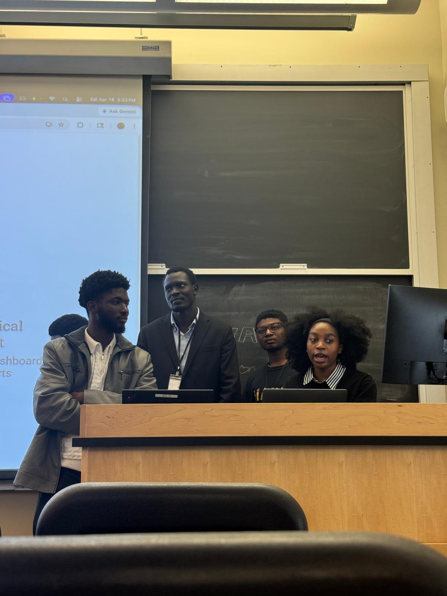
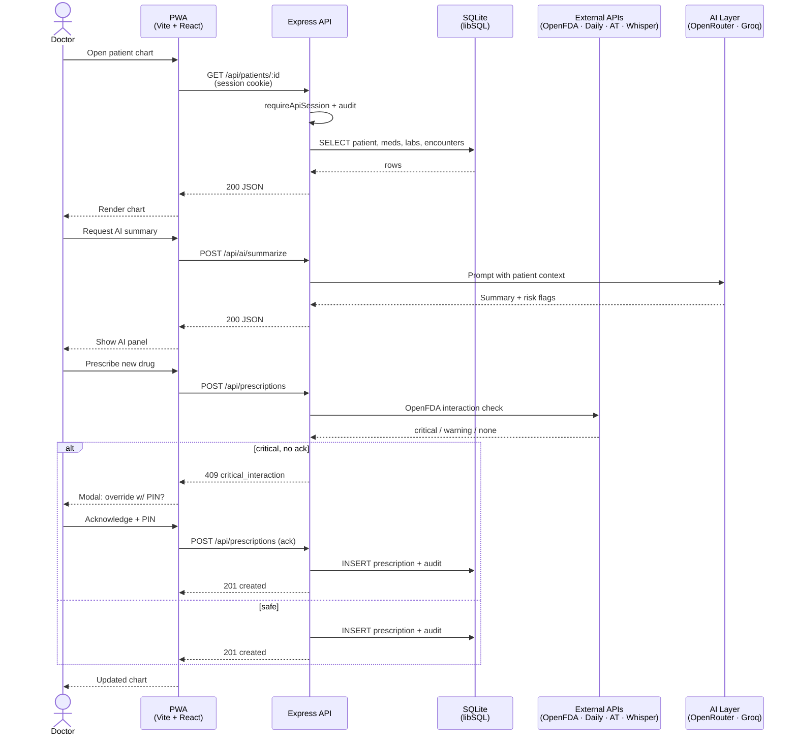

<picture>
  <source media="(prefers-color-scheme: dark)"  srcset="assets/banner-dark.png">
  <source media="(prefers-color-scheme: light)" srcset="assets/banner-light.png">
  
</picture>

[](https://github.com/Builder106/MedCore/actions/workflows/ci.yml)
[](https://github.com/Builder106/MedCore/actions/workflows/deploy.yml)
[](https://136-117-181-143.nip.io)
[](https://nodejs.org/)
[](https://www.typescriptlang.org/)
[](#license)
[](docs/DEMO.md)
[](server/src/lib/fhir-mappers.ts)
[](https://www.yaleafricainnovation.org/)

MedCore is a centralised digital health records platform for African healthcare providers — a **Vite + React PWA** front-end with a **Node + Express + SQLite (libSQL)** API. It implements the [PRD's eight features](docs/PRD.md) end-to-end with FHIR-shaped resources, RBAC-gated access, and an AI assist layer that summarises patient context and surfaces risk flags. Every external integration (Daily.co, OpenAI Whisper, Africa's Talking, OpenFDA, Web Push) ships with a working mock so the demo runs offline.

## 🏆 Recognition

**Winner — [Yale Africa Innovation Symposium IV](https://www.yaleafricainnovation.org/) (April 16–18, 2026)**, built within the **Technology & AI Innovation Lab** track under the symposium's "The Pulse of Progress" theme.

<table>
  <tr>
    <td width="50%"></td>
    <td width="50%"></td>
  </tr>
  <tr>
    <td align="center"><em>Final presentation, Yale, April 18, 2026</em></td>
    <td align="center"><em>Technology &amp; AI Innovation Lab participants, YAIS IV</em></td>
  </tr>
</table>

## Quick start

```bash
git clone https://github.com/Builder106/MedCore.git
cd MedCore
npm install
npm --prefix server install
npm run dev
```

- Web: <http://localhost:5173>
- API: <http://localhost:3001/api/health>

The Vite dev server proxies `/api/*` to the Express server on port 3001 and binds to `0.0.0.0`, so a phone on the same Wi-Fi can open `http://<laptop-ip>:5173`.

### Sign-in (demo)

| Role | User ID | Default PIN |
|------|---------|-------------|
| Doctor | `DOC-001` | `4242` |
| Patient | `PAT-001` | `1212` |
| Admin | `ADM-001` | `3434` |

PINs are configurable in `server/.env` (see `server/.env.example`). For production, set `SESSION_SECRET` to a long random string (≥32 characters). If a login fails after editing PINs, restart the API to resync demo PINs — dev does this on every start.

## How it works



All external integrations fall back to mocks when API keys are absent, so the canonical journey above works offline.

## Demo recordings

<details>
<summary><strong>YAIS IV walkthrough</strong> — full feature tour from the Yale presentation (≈3 min)</summary>

[](assets/medcore-demo.mp4)

The same walkthrough shown to YAIS IV judges. Covers: login → patient chart → AI summary → drug interaction override → voice consult transcription → video consult → SMS doctor commands → medication reminders → Health ID QR → offline PWA mode.

</details>

<details>
<summary><strong>Per-feature Gherkin demos</strong> — generated via the E2E demo suite</summary>

Per-feature recordings are produced by the `e2e/demo/` Gherkin suite. Generate them locally:

```bash
npx playwright install chromium
DEMO=1 npm run e2e:demo            # produces test-results/*.mp4
npm run e2e:demo:gif               # converts each to a GIF for embedding
```

Output paths and the cluster groupings used here are documented in [`docs/E2E.md`](docs/E2E.md).

</details>

## Demo on your phone

See [`docs/DEMO.md`](docs/DEMO.md) for the full phone walkthrough (PWA install, voice, video, push reminders, SMS, Health ID QR, offline/low-bandwidth).

Media APIs (camera, microphone, push) require a **secure context**:

```bash
# Option 1 — tunnel (recommended for dev)
cloudflared tunnel --url http://localhost:5173    # brew install cloudflared
# or
ngrok http 5173

# Option 2 — light cloud deploy (Fly.io / Railway / Render)
docker build -t medcore .
```

For the Africa's Talking SMS callback, point the inbound webhook at `https://<your-public-url>/api/sms/inbound` and send `PATIENT PAT-001 PIN:4242` from the phone number set as `DEMO_DOCTOR_PHONE` in `server/.env`.

## Tests

```bash
npm test                    # web (Vitest)
npm --prefix server test    # API + SMS + interaction + FHIR + integrations
npm --prefix server run typecheck
npm run test:all            # web + server
```

CI runs all of the above on every PR — see [`.github/workflows/ci.yml`](.github/workflows/ci.yml).

## Docs

| File | Contents |
|------|----------|
| [`docs/PRD.md`](docs/PRD.md) | Full product requirements document |
| [`docs/DEMO.md`](docs/DEMO.md) | Phone walkthrough for all 8 features |
| [`docs/ENV_SETUP.md`](docs/ENV_SETUP.md) | Guide to filling out `server/.env` |
| [`docs/go-to-market.md`](docs/go-to-market.md) | GTM strategy and pilot roadmap |
| [`docs/GUIDELINES.md`](docs/GUIDELINES.md) | Development conventions |
| [`docs/ATTRIBUTIONS.md`](docs/ATTRIBUTIONS.md) | Third-party licenses and credits |
| [`CONTRIBUTING.md`](CONTRIBUTING.md) | Dev setup, project guardrails, PR convention |

## Environment variables

Copy `server/.env.example` to `server/.env` and fill in only the integrations you need:

| Variable | Purpose | Fallback when empty |
| --- | --- | --- |
| `OPENROUTER_API_KEY` | AI summaries and risk flags | Returns a deterministic mock summary |
| `GROQ_API_KEY` / `OPENAI_API_KEY` | Whisper transcription (F2) | Returns realistic mock transcripts |
| `DAILY_API_KEY` / `DAILY_DOMAIN` | Video rooms (F3) | Falls back to a public Jitsi room |
| `AT_API_KEY` | SMS send (F4 & F5) | Logs to a mock outbox |
| `WEB_PUSH_PUBLIC_KEY` / `WEB_PUSH_PRIVATE_KEY` | Push reminders (F5) | In-memory fake send |
| `DATABASE_ENCRYPTION_KEY` | AES-256-GCM PII column encryption | Disabled (plaintext) — set before real PII |
| `DEMO_DOCTOR_PHONE` / `DEMO_PATIENT_PHONE` | Route SMS / reminders to your real number | — |

Generate VAPID keys: `npx web-push generate-vapid-keys`. Generate an encryption key: `node -e "console.log(require('crypto').randomBytes(32).toString('hex'))"`.

## PRD features implemented

1. **Multilingual (i18next, 5 languages + RTL Arabic)** — [`src/locales/`](src/locales/)
2. **Voice recording + AI transcription** — [`src/app/components/clinical/VoiceConsultPanel.tsx`](src/app/components/clinical/VoiceConsultPanel.tsx) and [`server/src/routes/voice.ts`](server/src/routes/voice.ts)
3. **Video consulting (Daily.co + Jitsi fallback)** — [`src/app/pages/VideoConsultPage.tsx`](src/app/pages/VideoConsultPage.tsx) and [`server/src/routes/video.ts`](server/src/routes/video.ts)
4. **SMS offline system** — [`server/src/routes/sms.ts`](server/src/routes/sms.ts) + doctor inbox at [`src/app/pages/SmsInboxPage.tsx`](src/app/pages/SmsInboxPage.tsx)
5. **Medication reminders + adherence** — [`server/src/routes/reminders.ts`](server/src/routes/reminders.ts) + doctor/patient UIs
6. **Drug interaction checker** — [`server/src/routes/interactions.ts`](server/src/routes/interactions.ts) + [`server/src/routes/prescriptions.ts`](server/src/routes/prescriptions.ts) with PIN override
7. **EHR domain — appointments, labs, vaccinations, referrals, encounters, inventory, staff, consent, audit** — `server/src/routes/*`
8. **AI assist + FHIR export** — [`server/src/routes/ai.ts`](server/src/routes/ai.ts), [`server/src/routes/fhir.ts`](server/src/routes/fhir.ts), [`server/src/lib/fhir-mappers.ts`](server/src/lib/fhir-mappers.ts)

## Postgres (production option)

```bash
docker compose up -d postgres
# then set DATABASE_URL in server/.env to a Postgres URL
```

The SQLite schema in [`server/src/db/migrations.sql`](server/src/db/migrations.sql) is portable; switching dialects only requires updating the Drizzle client.

## Contributing

PRs welcome. See [`CONTRIBUTING.md`](CONTRIBUTING.md) for dev setup, project guardrails (PHI safety, offline-first, mock-friendly integrations, RBAC), commit convention, and the out-of-scope list. CI must stay green.

## License

MedCore is released under the [MIT License](LICENSE). © 2026 Yinka Vaughan.

Third-party licenses and asset attributions are tracked in [`docs/ATTRIBUTIONS.md`](docs/ATTRIBUTIONS.md).
